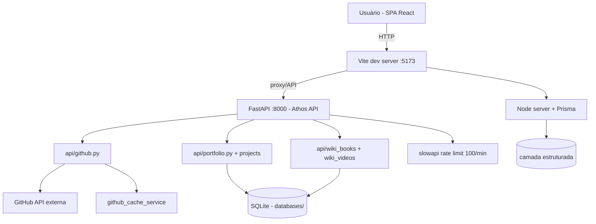

# 🔐 kernelcrypt — Plataforma Full-Stack de Portfólio & Wiki

<p align="center">
  
  <a href="https://github.com/panda12332145/kernelcrypt/commits/main"></a>
  <a href="https://github.com/panda12332145/kernelcrypt"></a>
  
  
  
</p>

---

## 🔖 Resumo

**kernelcrypt** é uma plataforma full-stack pessoal que consome a **API do GitHub** e a própria base de dados para servir um **portfólio dinâmico com wiki de livros e vídeos**. O frontend em React renderiza projetos, artigos e biblioteca; o backend FastAPI ("Athos API") orquestra fontes externas e internas com rate limiting; um servidor Node com Prisma cuida da camada estruturada.

### ✨ Funcionalidades Principais

- ✅ **API GitHub integrada** — puxa repositórios, linguagens e estatísticas (`api/github.py`)
- ✅ **Portfólio dinâmico** — projetos e perfis servidos via API (`api/portfolio.py`, `api/projects.py`)
- ✅ **Wiki de livros e vídeos** — biblioteca com conversão/seed de conteúdo (`api/wiki_books.py`, `api/wiki_videos.py`)
- ✅ **Rate limiting** — proteção contra abuso com `slowapi` (100 req/min por padrão)
- ✅ **Frontend React 19 + Vite + Tailwind 4** — SPA com router, busca (fuse.js) e markdown (react-markdown + DOMPurify)
- ✅ **Servidor Node + Prisma** — camada estruturada com geração de tipos
- ✅ **Bancos SQLite com seeds** — `databases/` com scripts de popularização

---

## 📽 Demonstração

```text
GET / → {"status":"online","message":"Athos Backend Running"}

Rotas disponíveis:
  GET  /api/github       → repositórios e stats do GitHub
  GET  /api/portfolio    → dados do portfólio
  GET  /api/projects     → projetos em destaque
  GET  /api/wiki_books   → livros da wiki
  GET  /api/wiki_videos  → vídeos da wiki
```

---

## ⚙️ Explicação das Partes Importantes

### Backend FastAPI (`backend/app/main.py`)
```python
from fastapi import FastAPI
from slowapi import Limiter
limiter = Limiter(key_func=get_remote_address, default_limits=["100/minute"])
app = FastAPI(title="Athos API", version="1.0.0")
```
> Ponto de entrada da API: CORS restrito ao dev server, rate limiting global e registro de todos os routers.

### Serviços (`backend/app/services/`)
```python
github_service.py      # busca dados da API do GitHub (com cache)
github_cache_service.py# cache para evitar rate limit do GitHub
portfolio_service.py   # monta o portfólio
wiki_book_service.py   # livros
wiki_video_service.py  # vídeos
```
> Camada de serviço isolada das rotas — cada fonte tem seu módulo, facilitando testes e troca de implementação.

### Frontend (`src/`)
```text
pages/       # rotas da SPA
components/  # UI reutilizável
hooks/       # estado e efeitos
lib/ utils/  # helpers (busca, storage, datas)
```
> React 19 com `react-router-dom`, `fuse.js` (busca fuzzy) e `react-markdown` sanitizado com `DOMPurify`.

### Segurança
- Rate limiting (`slowapi`) contra abuso da API
- `dompurify` no frontend ao renderizar markdown
- Credenciais **não versionadas** — `.env` e logs no `.gitignore` *(corrigido na auditoria de segurança)*

---

## 🔄 Fluxo de Trabalho / Arquitetura



**Fluxo detalhado:**

1. **Frontend** sobe no Vite (5173) e consome a API
2. **FastAPI** valida, aplica rate limit e despacha para os services
3. **Services** consultam GitHub API (com cache) ou os bancos SQLite
4. **Seeds** popular os bancos (`databases/seed_*.py`)
5. **Resposta** volta estruturada em JSON para a SPA

---

## 📂 Estrutura do Projeto

```plaintext
kernelcrypt/
├── index.html              # Entry do frontend
├── vite.config.ts          # Config Vite + plugin singlefile
├── package.json            # React 19, Tailwind 4, Vite
├── src/                    # Frontend SPA
│   ├── pages/ components/ hooks/ lib/ utils/
│   └── App.tsx main.tsx
├── backend/                # API FastAPI
│   ├── backend_server.py
│   ├── requirements.txt
│   └── app/
│       ├── main.py         # FastAPI + slowapi
│       ├── api/            # github, portfolio, projects, wiki_books, wiki_videos, cyber_profiles
│       ├── services/       # camada de serviço + cache
│       └── core/           # config
├── server/                 # Servidor Node + Prisma
│   ├── src/ prisma/ dist/
├── databases/              # SQLite + seeds
├── library/books/          # conteúdo da wiki
├── public/ dist/           # assets
└── .gitignore              # bloqueia .env, logs e credenciais
```

---

## 🛠️ Tecnologias

| Camada | Stack |
|---|---|
| Frontend | React 19 · TypeScript · Vite · Tailwind CSS 4 · react-router · fuse.js · react-markdown |
| Backend API | Python · FastAPI · slowapi (rate limit) |
| Servidor | Node.js · Prisma |
| Dados | SQLite (bancos + seeds) · GitHub API |
| Segurança | DOMPurify · rate limiting · .gitignore de segredos |

---

## ▶️ Instalação

```bash
git clone https://github.com/panda12332145/kernelcrypt.git
cd kernelcrypt

# Frontend
npm install
npm run dev            # http://localhost:5173

# Backend (outra aba)
pip install -r backend/requirements.txt
cd backend && uvicorn app.main:app --port 8000

# Popular bancos (opcional)
python databases/seed_projects.py
python databases/seed_wiki_books.py
python databases/seed_wiki_videos.py
```

---

## 🚀 Execução

```bash
npm run dev       # frontend Vite
npm run build     # build de produção
uvicorn app.main:app --reload   # API
```

---

## ⚠️ Limitações

- Nome do repositório ainda não reflete o conteúdo (candidato a rename)
- Bancos SQLite versionados — considerar gitignore + migração
- Sem testes automatizados de API ainda
- `server/` e `backend/` coexistem — roadmap de unificação

---

## 🚀 Roadmap

- [x] API GitHub + portfólio + wiki
- [x] Rate limiting e DOMPurify
- [x] Remoção de credenciais versionadas *(auditoria)*
- [ ] Testes automatizados (pytest + vitest)
- [ ] Rename do repositório
- [ ] CI com build + deploy
- [ ] Unificar `server/` e `backend/`

---

## 📄 Licença

MIT License.

---

## 👾 Autor

<p align="center">
  
</p>

<p align="center">Feito por <strong>Panda12332145</strong> 👋🏽</p>

---

## 🧑‍💻 Sobre Mim

Sou apaixonado por **Física Teórica, Cibersegurança e Desenvolvimento de Sistemas**. Tenho grande interesse em programação de baixo nível, engenharia reversa, automação, sistemas Windows, criptografia e segurança ofensiva. Também gosto bastante de música, filosofia e computação avançada.

---

## 🌐 Redes

* **Site:** [https://panda-h0me.netlify.app/](https://panda-h0me.netlify.app/)
* **YouTube:** [https://www.youtube.com/@X86BinaryGhost](https://www.youtube.com/@X86BinaryGhost)
* **Instagram:** [https://www.instagram.com/01pandal10/](https://www.instagram.com/01pandal10/)
* **GitHub:** [https://github.com/panda12332145](https://github.com/panda12332145)
* **LinkedIn:** [linkedin.com/in/athos-da-boanergis](https://www.linkedin.com/in/athos-d%C3%A3-boanergis-5585a4288/)

---

## 🚀 Áreas de Interesse

* **Cibersegurança Avançada** 🔒
* **Hacking & Engenharia Reversa** 💻
* **Computação de Baixo Nível** 🖥️
* **Matemática e Física Teórica** 📐⚛️
* **Desenvolvimento de Ferramentas de Segurança** 🛠️

_"Conhecimento é poder, e domínio técnico vem da compreensão profunda dos sistemas."_

---

## 📞 Contato & Suporte

Para colaborações, dúvidas ou sugestões:

📧 **E-mail:** [athos.cybersec@gmail.com](mailto:athos.cybersec@gmail.com)

🐛 **Reportar Bug:** [Abrir Issue](https://github.com/panda12332145/kernelcrypt/issues)

💡 **Sugerir Melhoria:** [Discussions](https://github.com/panda12332145/kernelcrypt/discussions)
